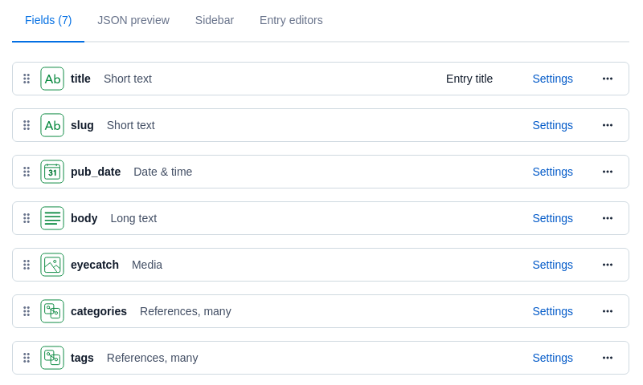
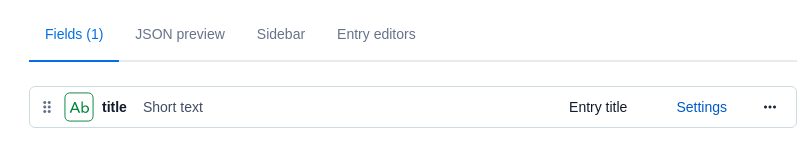

# hugo-contentful-blog

Blog sample with Hugo and Contentful by [ModiiMedia/contentful-hugo](https://github.com/ModiiMedia/contentful-hugo)

## Set up

* requirements
    * Hugo
    * Node.js

### By clone

Clone this repository including submodules

```shell
git clone --recursive https://github.com/higebobo/hugo-contentful-blog
```

Install the package for Node.js(postcss, contentful-hugo)

```shell
npm install
```

### From scratch

Create a new site

```shell
hugo new site hugo-contentful-blog
```

Create a git repository

```shell
cd hugo-contentful-blog
git init
echo '*~' >> .gitignore
echo '*.bak' >> .gitignore
echo '*.orig' >> .gitignore
echo '.env' >> .gitignore
echo 'public' >> .gitignore
echo 'resources' >> .gitignore
```

Copy config file and others from theme directory

```shell
cp -pr themes/blonde/exampleSite/{config.toml,content,package.json} .
```

Install postcss

```shell
npm install
echo 'node_modules' >> .gitignore
```

Install contentful-hugo

```shell
npm install contentful-hugo
contentful-hugo --init
```

Add scripts in package.json

```json
{
    "name": "Blonde",
    "scripts": {
        "dev": "contentful-hugo --preview && hugo server",
        "build": "contentful-hugo && hugo --minify"
    },
```

### Contentful models

Create contentful models as you like.
In my case, shown below (**id is important rather than name**)

#### Blog post

* name: HugoContentfulPost
* id: hugoContentfulPost



#### Blog categor

* name: HugoContentfulCategory
* id: hugoContentfulCategory



#### Blog tag

* name: HugoContentfulTag
* id: hugoContentfulTag


### Github Actions and Github Pages

Set `.github/workflows/<youractions>.yaml` and environment variables for Contentful in `Settings`>`Secrets`

## Customize

You need customize setting files.

* .env
    * see the [.env.sample](./.env.sample)
* config.toml
* contentful-hugo.config.js
    * see the [contentful-hugo.config.js.sample](./contentful-hugo.config.js.sample)

## Run

Run server

```shell
npm run dev
```

Build static files

```shell
npm run build
```
